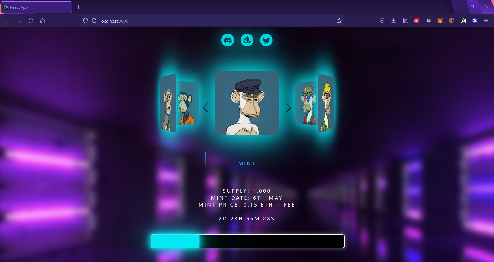
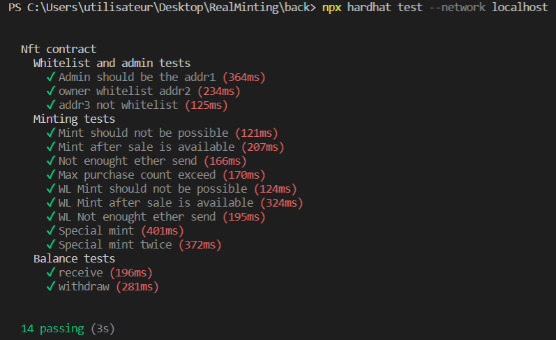

<div id="top"></div>
<!--
*** Thanks for checking out the Best-README-Template. If you have a suggestion
*** that would make this better, please fork the repo and create a pull request
*** or simply open an issue with the tag "enhancement".
*** Don't forget to give the project a star!
*** Thanks again! Now go create something AMAZING! :D
-->


<!-- PROJECT SHIELDS -->
<!--
*** I'm using markdown "reference style" links for readability.
*** Reference links are enclosed in brackets [ ] instead of parentheses ( ).
*** See the bottom of this document for the declaration of the reference variables
*** for contributors-url, forks-url, etc. This is an optional, concise syntax you may use.
*** https://www.markdownguide.org/basic-syntax/#reference-style-links
-->
[![MIT License][license-shield]][license-url]
[![LinkedIn][linkedin-shield]][linkedin-url]


<br />
<div align="center">
  <h1> NFT Minting Website x Solidity Smart Contract </h1>
  <br /><br />
</div>

<!-- TABLE OF CONTENTS -->
<summary>Table of Contents</summary>
  <ol>
    <li>
      <a href="#about-the-project">About The Project</a>
      <ul>
        <li><a href="#built-with">Built With</a></li>
      </ul>
    </li>
    <li>
      <a href="#getting-started">Getting Started</a>
      <ul>
        <li><a href="#installation">Installation</a></li>
      </ul>
    </li>
    <li><a href="#license">License</a></li>
    <li><a href="#contact">Contact</a></li>
  </ol>

<!-- ABOUT THE PROJECT -->
## About The Project



<p> 
  This project was realized in order to present a portfolio of applications around the blockchain. <br /> 
  In this case it is a website allowing to mint nfts. <br />
  This project contains absolutely all the elements necessary for the functioning of this type of product. <br />
</p>

### Built With

This section list the major frameworks used to bootstrap my project.

* [React.js](https://reactjs.org/)
* [Hardhat](https://hardhat.org/)
* [HashLips](https://github.com/HashLips)

<!-- GETTING STARTED -->
## Getting Started

This sections explains how to lunch the application.

### Installation

_Frontend React App_

1. Clone the repo
   ```sh
   git clone https://github.com/clementjuventin/NFT-Minting-Website-x-Smart-contract.git
   ```
2. Move to the `/frontend` repository
   ```sh
   cd /frontend
   ```
3. Install NPM packages
   ```sh
   npm install
   ```
4. Lunch the application
   ```js
   npm start
   ```
_Please note that by default, you will interract with a contract that I made myself on the network rinkeby. Take care to replace the contract by yours or to be on the same network as the contract._

<br/>

_Backend with Hardhat_

1. Clone the repo (if not done)
   ```sh
   git clone https://github.com/clementjuventin/NFT-Minting-Website-x-Smart-contract.git
   ```
2. Move to the `/backend` repository
   ```sh
   cd /backend
   ```
3. Install NPM packages
   ```sh
   npm install
   ```
4. Configure your `.env` file
   ```js
   PK = "YOUR_PRIVATE_KEY"
   ```
5. Then you can deploy/test the contract
   ```js
   //If you run your own node with this command
   npx hardhat node
   
   //Then you can open another shell and type this to test the contract and obtain the results bellow
   npx hardhat test --network localhost
   ```
  

   ```js
   //You can also deploy the contract on rinkeby (config file: hardhat.config.js) 
   //You need to set your private key as explained in step 4
   // Get some faucets to deploy the contract on https://faucets.chain.link/rinkeby
   npx hardhat run scripts/deploy.js --network rinkeby
   ```

<!-- LICENSE -->
## License

Distributed under the MIT License. See `LICENSE.txt` for more information.

<p align="right">(<a href="#top">back to top</a>)</p>


<!-- CONTACT -->
## Contact

Clément Juventin - clementjuventin@gmail.com

My Github: [https://github.com/clementjuventin](https://github.com/clementjuventin)

<!-- MARKDOWN LINKS & IMAGES -->
[license-shield]: https://img.shields.io/github/license/othneildrew/Best-README-Template.svg?style=for-the-badge
[license-url]: https://github.com/othneildrew/Best-README-Template/blob/master/LICENSE.txt
[linkedin-shield]: https://img.shields.io/badge/-LinkedIn-black.svg?style=for-the-badge&logo=linkedin&colorB=555
[linkedin-url]: https://www.linkedin.com/in/cl%C3%A9ment-juventin-ab81841a3/
